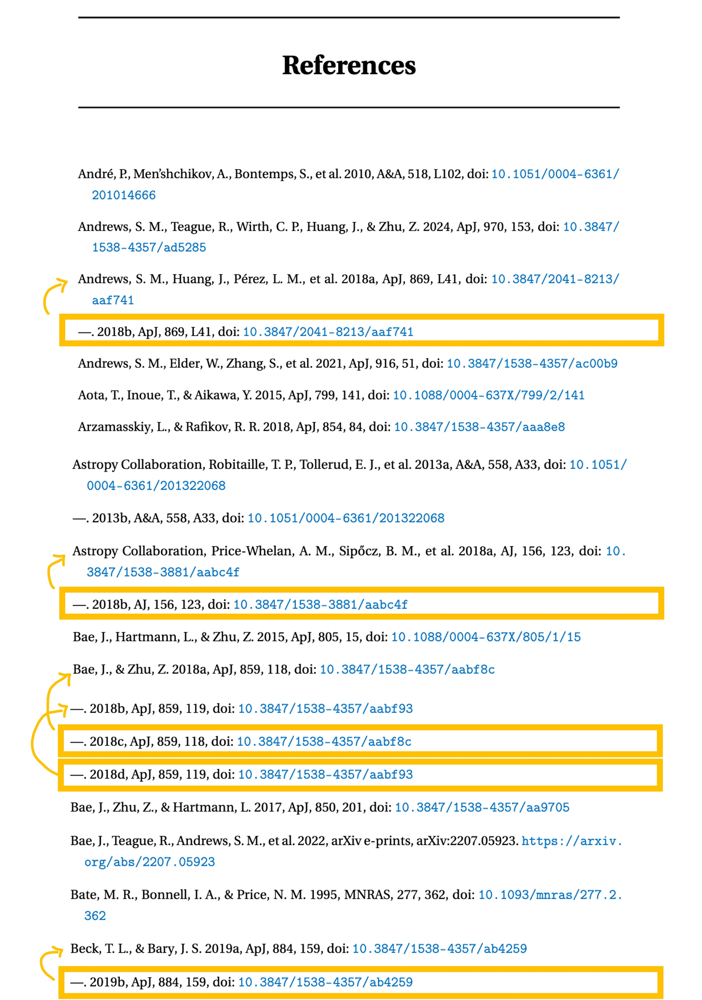

# Dealing with references when writing a sandwich thesis

You published multiple papers. They all need to go in the thesis. You wrote them at different times using different .bib files. There are definitely references in common between the papers, but the bibkeys are not consistent. You want to minimize the manual effort in unifying your sandwich thesis bibliography. Here's the steps I took to do this:

## 1. Collect the .bib files

Return to the Overleaf project of each individual paper. Download the .bib file. Store them in a working directory and name them as follows: 

```bash
bib-merges >> ls .
chapter2.bib
chapter3.bib
chapter3.bib
chapter3.bib
```

## 2. Merge the .bib files 

Install [``bib-tool``](https://formulae.brew.sh/formula/bib-tool) (see also [https://www.gerd-neugebauer.de/software/TeX/BibTool/en/](https://www.gerd-neugebauer.de/software/TeX/BibTool/en/)). 

```bash
brew install bib-tool
```

Use it to merge the .bib files. This command merges, sorts, and comments-out duplicates:

```bash
bib-merges >> bibtool -s -d chapter2.bib chapter3.bib chapter4.bib chapter5.bib -o merged2345.bib
```

What we want out of this step is the file ``merged2345.bib``. Since Chapter 1 is the Introduction, the four papers in this example comprise Chapter 2, 3, 4 and 5 (hence the merged .bib file name).

*What gets counted as a duplicate?* Entries here are counted as duplicates based on their bibkey (the first thing in the .bib item entry). Here's an example of a duplicate and what happens to it; the bibkey is ``jvm1995-correction``:

```
@Article{	  jvm1995-correction,
  author	= {{Jorsater}, Steven and {van Moorsel}, Gustaaf A.},
  title		= "{High Resolution Neutral Hydrogen Observations of the
		  Barred Spiral Galaxy NGC 1365}",
  journal	= {\aj},
  keywords	= {GALAXIES: INDIVIDUAL: NGC 1365, GALAXIES: SPIRAL,
		  GALAXIES, KINEMATICS AND DYNAMICS},
  year		= 1995,
  month		= nov,
  volume	= {110},
  pages		= {2037},
  doi		= {10.1086/117668},
  adsurl	= {https://ui.adsabs.harvard.edu/abs/1995AJ....110.2037J},
  adsnote	= {Provided by the SAO/NASA Astrophysics Data System}
}

###Article{	  jvm1995-correction,
  author	= {{Jorsater}, Steven and {van Moorsel}, Gustaaf A.},
  title		= "{High Resolution Neutral Hydrogen Observations of the
		  Barred Spiral Galaxy NGC 1365}",
  journal	= {\aj},
  keywords	= {GALAXIES: INDIVIDUAL: NGC 1365, GALAXIES: SPIRAL,
		  GALAXIES, KINEMATICS AND DYNAMICS},
  year		= 1995,
  month		= nov,
  volume	= {110},
  pages		= {2037},
  doi		= {10.1086/117668},
  adsurl	= {https://ui.adsabs.harvard.edu/abs/1995AJ....110.2037J},
  adsnote	= {Provided by the SAO/NASA Astrophysics Data System}
}
```

Importantly, this means that differing bibkeys referring to the *same paper* will be retained in the ``merged2345.bib`` file. Here's an example of that:

```
@Article{	  beck2019,
  author	= {{Beck}, Tracy L. and {Bary}, Jeffrey S.},
  title		= "{A Search for Spatially Resolved Infrared Rovibrational
		  Molecular Hydrogen Emission from the Disks of Young Stars}",
  journal	= {\apj},
  keywords	= {stars: formation, stars: individual: AA Tau, stars:
		  pre-main sequence, Astrophysics - Solar and Stellar
		  Astrophysics, Astrophysics - Astrophysics of Galaxies},
  year		= 2019,
  month		= oct,
  volume	= {884},
  number	= {2},
  eid		= {159},
  pages		= {159},
  doi		= {10.3847/1538-4357/ab4259},
  archiveprefix	= {arXiv},
  eprint	= {1909.04730},
  primaryclass	= {astro-ph.SR},
  adsurl	= {https://ui.adsabs.harvard.edu/abs/2019ApJ...884..159B},
  adsnote	= {Provided by the SAO/NASA Astrophysics Data System}
}

@Article{	  beck2019-h2,
  author	= {{Beck}, Tracy L. and {Bary}, Jeffrey S.},
  title		= "{A Search for Spatially Resolved Infrared Rovibrational
		  Molecular Hydrogen Emission from the Disks of Young Stars}",
  journal	= {\apj},
  keywords	= {stars: formation, stars: individual: AA Tau, stars:
		  pre-main sequence, Astrophysics - Solar and Stellar
		  Astrophysics, Astrophysics - Astrophysics of Galaxies},
  year		= 2019,
  month		= oct,
  volume	= {884},
  number	= {2},
  eid		= {159},
  pages		= {159},
  doi		= {10.3847/1538-4357/ab4259},
  archiveprefix	= {arXiv},
  eprint	= {1909.04730},
  primaryclass	= {astro-ph.SR},
  adsurl	= {https://ui.adsabs.harvard.edu/abs/2019ApJ...884..159B},
  adsnote	= {Provided by the SAO/NASA Astrophysics Data System}
}
```

## 3. Make a merged .bbl file 

The next part is really the trick. We leverage the compiled .bbl to do some of the work for us.

### i. Compile the Overleaf thesis project with the merged .bib file

Upload the merged .bib file (``merged2345.bib``) into your sandwich Overleaf project. [I'm assuming the Overleaf project already contains the copy-and-pasted contents of each of the papers.] Compile *the whole sandwich thesis*, with ``merged2345.bib`` as the sole .bib file being used to generate the bibliography. *Every single in-text citation should appear in the bibliography*. However, the references in common between papers should appear in the bibliography *more than once* (!!). This really is the problem we are trying to solve. Here's how it looks:



In the above bibliography, you can see there are duplicate references. These papers were cited in multiple chapters of the thesis, but using differing bibkeys. Our ``beck2019`` vs. ``beck2019-h2`` is visible at the bottom there.

### ii. Download the resulting .bbl file 

Click the "Logs and outputs" button at the top left of the Overleaf PDF window, where the log messages are displayed about the most recent compilation. At the bottom, next to the "Clear cached files" button, click the "Other logs and files" button (you may need to scroll to reach the bottom). Download the file ``output.bbl``. Put it in your same working directory. Rename it to ``chapter2+3+4+5_output.bbl``. 

## 4. Parse the .bbl file in python to make a mapping dictionary

The format of a .bbl file is handy and we can use it to identify the duplicates by their bibkeys and DOIs. 

Copy and paste the main contents of ``chapter2+3+4+5_output.bbl`` into the python file ``parse_bbl.py`` to set the ``bbl_content`` string. Here's an example:

```python
bbl_content = r"""

\bibitem[{{Andr{\'e}} {et~al.}(2010){Andr{\'e}}, {Men'shchikov}, {Bontemps}, {K{\"o}nyves}, {Motte}, {Schneider}, {Didelon}, {Minier}, {Saraceno}, {Ward-Thompson}, {di Francesco}, {White}, {Molinari}, {Testi}, {Abergel}, {Griffin}, {Henning}, {Royer}, {Mer{\'\i}n}, {Vavrek}, {Attard}, {Arzoumanian}, {Wilson}, {Ade}, {Aussel}, {Baluteau}, {Benedettini}, {Bernard}, {Blommaert}, {Cambr{\'e}sy}, {Cox}, {di Giorgio}, {Hargrave}, {Hennemann}, {Huang}, {Kirk}, {Krause}, {Launhardt}, {Leeks}, {Le Pennec}, {Li}, {Martin}, {Maury}, {Olofsson}, {Omont}, {Peretto}, {Pezzuto}, {Prusti}, {Roussel}, {Russeil}, {Sauvage}, {Sibthorpe}, {Sicilia-Aguilar}, {Spinoglio}, {Waelkens}, {Woodcraft}, \& {Zavagno}}]{andre2010-KPGT_pandre_1}
{Andr{\'e}}, P., {Men'shchikov}, A., {Bontemps}, S., {et~al.} 2010, \aap, 518, L102, \dodoi{10.1051/0004-6361/201014666}

\bibitem[{{Andrews} {et~al.}(2024){Andrews}, {Teague}, {Wirth}, {Huang}, \& {Zhu}}]{andrews2024-behemoth}
{Andrews}, S.~M., {Teague}, R., {Wirth}, C.~P., {Huang}, J., \& {Zhu}, Z. 2024, \apj, 970, 153, \dodoi{10.3847/1538-4357/ad5285}

\bibitem[{{Andrews} {et~al.}(2018{\natexlab{a}}){Andrews}, {Huang}, {P{\'e}rez}, {Isella}, {Dullemond}, {Kurtovic}, {Guzm{\'a}n}, {Carpenter}, {Wilner}, {Zhang}, {Zhu}, {Birnstiel}, {Bai}, {Benisty}, {Hughes}, {{\"O}berg}, \& {Ricci}}]{2018-andrews-dsharp1}
{Andrews}, S.~M., {Huang}, J., {P{\'e}rez}, L.~M., {et~al.} 2018{\natexlab{a}}, \apjl, 869, L41, \dodoi{10.3847/2041-8213/aaf741}

\bibitem[{{Andrews} {et~al.}(2018{\natexlab{b}}){Andrews}, {Huang}, {P{\'e}rez}, {Isella}, {Dullemond}, {Kurtovic}, {Guzm{\'a}n}, {Carpenter}, {Wilner}, {Zhang}, {Zhu}, {Birnstiel}, {Bai}, {Benisty}, {Hughes}, {{\"O}berg}, \& {Ricci}}]{andrews18-dsharp1}
---. 2018{\natexlab{b}}, \apjl, 869, L41, \dodoi{10.3847/2041-8213/aaf741}

\bibitem[{{Andrews} {et~al.}(2021){Andrews}, {Elder}, {Zhang}, {Huang}, {Benisty}, {Kurtovic}, {Wilner}, {Zhu}, {Carpenter}, {P{\'e}rez}, {Teague}, {Isella}, \& {Ricci}}]{andrews21-frank-dsharp}
{Andrews}, S.~M., {Elder}, W., {Zhang}, S., {et~al.} 2021, \apj, 916, 51, \dodoi{10.3847/1538-4357/ac00b9}

\bibitem[{{Aota} {et~al.}(2015){Aota}, {Inoue}, \& {Aikawa}}]{aota2015}
{Aota}, T., {Inoue}, T., \& {Aikawa}, Y. 2015, \apj, 799, 141, \dodoi{10.1088/0004-637X/799/2/141}

\bibitem[{{Arzamasskiy} \& {Rafikov}(2018)}]{2018-arzamasskiy}
{Arzamasskiy}, L., \& {Rafikov}, R.~R. 2018, \apj, 854, 84, \dodoi{10.3847/1538-4357/aaa8e8}

\bibitem[{{Astropy Collaboration} {et~al.}(2013{\natexlab{a}}){Astropy Collaboration}, {Robitaille}, {Tollerud}, {Greenfield}, {Droettboom}, {Bray}, {Aldcroft}, {Davis}, {Ginsburg}, {Price-Whelan}, {Kerzendorf}, {Conley}, {Crighton}, {Barbary}, {Muna}, {Ferguson}, {Grollier}, {Parikh}, {Nair}, {Unther}, {Deil}, {Woillez}, {Conseil}, {Kramer}, {Turner}, {Singer}, {Fox}, {Weaver}, {Zabalza}, {Edwards}, {Azalee Bostroem}, {Burke}, {Casey}, {Crawford}, {Dencheva}, {Ely}, {Jenness}, {Labrie}, {Lim}, {Pierfederici}, {Pontzen}, {Ptak}, {Refsdal}, {Servillat}, \& {Streicher}}]{astropy:2013}
{Astropy Collaboration}, {Robitaille}, T.~P., {Tollerud}, E.~J., {et~al.} 2013{\natexlab{a}}, \aap, 558, A33, \dodoi{10.1051/0004-6361/201322068}

\bibitem[{{Astropy Collaboration} {et~al.}(2013{\natexlab{b}}){Astropy Collaboration}, {Robitaille}, {Tollerud}, {Greenfield}, {Droettboom}, {Bray}, {Aldcroft}, {Davis}, {Ginsburg}, {Price-Whelan}, {Kerzendorf}, {Conley}, {Crighton}, {Barbary}, {Muna}, {Ferguson}, {Grollier}, {Parikh}, {Nair}, {Unther}, {Deil}, {Woillez}, {Conseil}, {Kramer}, {Turner}, {Singer}, {Fox}, {Weaver}, {Zabalza}, {Edwards}, {Azalee Bostroem}, {Burke}, {Casey}, {Crawford}, {Dencheva}, {Ely}, {Jenness}, {Labrie}, {Lim}, {Pierfederici}, {Pontzen}, {Ptak}, {Refsdal}, {Servillat}, \& {Streicher}}]{software-astropy1}
---. 2013{\natexlab{b}}, \aap, 558, A33, \dodoi{10.1051/0004-6361/201322068}

\bibitem[{{Astropy Collaboration} {et~al.}(2018{\natexlab{a}}){Astropy Collaboration}, {Price-Whelan}, {Sip{\H{o}}cz}, {G{\"u}nther}, {Lim}, {Crawford}, {Conseil}, {Shupe}, {Craig}, {Dencheva}, {Ginsburg}, {Vand erPlas}, {Bradley}, {P{\'e}rez-Su{\'a}rez}, {de Val-Borro}, {Aldcroft}, {Cruz}, {Robitaille}, {Tollerud}, {Ardelean}, {Babej}, {Bach}, {Bachetti}, {Bakanov}, {Bamford}, {Barentsen}, {Barmby}, {Baumbach}, {Berry}, {Biscani}, {Boquien}, {Bostroem}, {Bouma}, {Brammer}, {Bray}, {Breytenbach}, {Buddelmeijer}, {Burke}, {Calderone}, {Cano Rodr{\'\i}guez}, {Cara}, {Cardoso}, {Cheedella}, {Copin}, {Corrales}, {Crichton}, {D'Avella}, {Deil}, {Depagne}, {Dietrich}, {Donath}, {Droettboom}, {Earl}, {Erben}, {Fabbro}, {Ferreira}, {Finethy}, {Fox}, {Garrison}, {Gibbons}, {Goldstein}, {Gommers}, {Greco}, {Greenfield}, {Groener}, {Grollier}, {Hagen}, {Hirst}, {Homeier}, {Horton}, {Hosseinzadeh}, {Hu}, {Hunkeler}, {Ivezi{\'c}}, {Jain}, {Jenness}, {Kanarek}, {Kendrew}, {Kern}, {Kerzendorf}, {Khvalko}, {King}, {Kirkby},
  {Kulkarni}, {Kumar}, {Lee}, {Lenz}, {Littlefair}, {Ma}, {Macleod}, {Mastropietro}, {McCully}, {Montagnac}, {Morris}, {Mueller}, {Mumford}, {Muna}, {Murphy}, {Nelson}, {Nguyen}, {Ninan}, {N{\"o}the}, {Ogaz}, {Oh}, {Parejko}, {Parley}, {Pascual}, {Patil}, {Patil}, {Plunkett}, {Prochaska}, {Rastogi}, {Reddy Janga}, {Sabater}, {Sakurikar}, {Seifert}, {Sherbert}, {Sherwood-Taylor}, {Shih}, {Sick}, {Silbiger}, {Singanamalla}, {Singer}, {Sladen}, {Sooley}, {Sornarajah}, {Streicher}, {Teuben}, {Thomas}, {Tremblay}, {Turner}, {Terr{\'o}n}, {van Kerkwijk}, {de la Vega}, {Watkins}, {Weaver}, {Whitmore}, {Woillez}, {Zabalza}, \& {Astropy Contributors}}]{astropy:2018}
{Astropy Collaboration}, {Price-Whelan}, A.~M., {Sip{\H{o}}cz}, B.~M., {et~al.} 2018{\natexlab{a}}, \aj, 156, 123, \dodoi{10.3847/1538-3881/aabc4f}

\bibitem[{{Astropy Collaboration} {et~al.}(2018{\natexlab{b}}){Astropy Collaboration}, {Price-Whelan}, {Sip{\H{o}}cz}, {G{\"u}nther}, {Lim}, {Crawford}, {Conseil}, {Shupe}, {Craig}, {Dencheva}, {Ginsburg}, {VanderPlas}, {Bradley}, {P{\'e}rez-Su{\'a}rez}, {de Val-Borro}, {Aldcroft}, {Cruz}, {Robitaille}, {Tollerud}, {Ardelean}, {Babej}, {Bach}, {Bachetti}, {Bakanov}, {Bamford}, {Barentsen}, {Barmby}, {Baumbach}, {Berry}, {Biscani}, {Boquien}, {Bostroem}, {Bouma}, {Brammer}, {Bray}, {Breytenbach}, {Buddelmeijer}, {Burke}, {Calderone}, {Cano Rodr{\'\i}guez}, {Cara}, {Cardoso}, {Cheedella}, {Copin}, {Corrales}, {Crichton}, {D'Avella}, {Deil}, {Depagne}, {Dietrich}, {Donath}, {Droettboom}, {Earl}, {Erben}, {Fabbro}, {Ferreira}, {Finethy}, {Fox}, {Garrison}, {Gibbons}, {Goldstein}, {Gommers}, {Greco}, {Greenfield}, {Groener}, {Grollier}, {Hagen}, {Hirst}, {Homeier}, {Horton}, {Hosseinzadeh}, {Hu}, {Hunkeler}, {Ivezi{\'c}}, {Jain}, {Jenness}, {Kanarek}, {Kendrew}, {Kern}, {Kerzendorf}, {Khvalko}, {King}, {Kirkby},
  {Kulkarni}, {Kumar}, {Lee}, {Lenz}, {Littlefair}, {Ma}, {Macleod}, {Mastropietro}, {McCully}, {Montagnac}, {Morris}, {Mueller}, {Mumford}, {Muna}, {Murphy}, {Nelson}, {Nguyen}, {Ninan}, {N{\"o}the}, {Ogaz}, {Oh}, {Parejko}, {Parley}, {Pascual}, {Patil}, {Patil}, {Plunkett}, {Prochaska}, {Rastogi}, {Reddy Janga}, {Sabater}, {Sakurikar}, {Seifert}, {Sherbert}, {Sherwood-Taylor}, {Shih}, {Sick}, {Silbiger}, {Singanamalla}, {Singer}, {Sladen}, {Sooley}, {Sornarajah}, {Streicher}, {Teuben}, {Thomas}, {Tremblay}, {Turner}, {Terr{\'o}n}, {van Kerkwijk}, {de la Vega}, {Watkins}, {Weaver}, {Whitmore}, {Woillez}, {Zabalza}, \& {Astropy Contributors}}]{software-astropy2}
---. 2018{\natexlab{b}}, \aj, 156, 123, \dodoi{10.3847/1538-3881/aabc4f}

\bibitem[{{Bae} {et~al.}(2015){Bae}, {Hartmann}, \& {Zhu}}]{bae2015-infall-rwi}
{Bae}, J., {Hartmann}, L., \& {Zhu}, Z. 2015, \apj, 805, 15, \dodoi{10.1088/0004-637X/805/1/15}

\bibitem[{{Bae} \& {Zhu}(2018{\natexlab{a}})}]{2018a-bae-zhu}
{Bae}, J., \& {Zhu}, Z. 2018{\natexlab{a}}, \apj, 859, 118, \dodoi{10.3847/1538-4357/aabf8c}

\bibitem[{{Bae} \& {Zhu}(2018{\natexlab{b}})}]{2018b-bae-zhu}
---. 2018{\natexlab{b}}, \apj, 859, 119, \dodoi{10.3847/1538-4357/aabf93}

\bibitem[{{Bae} \& {Zhu}(2018{\natexlab{c}})}]{bae+zhu18-spirals1}
---. 2018{\natexlab{c}}, \apj, 859, 118, \dodoi{10.3847/1538-4357/aabf8c}

\bibitem[{{Bae} \& {Zhu}(2018{\natexlab{d}})}]{bae+zhu18-spirals2}
---. 2018{\natexlab{d}}, \apj, 859, 119, \dodoi{10.3847/1538-4357/aabf93}

\bibitem[{{Bae} {et~al.}(2017){Bae}, {Zhu}, \& {Hartmann}}]{2017-bae}
{Bae}, J., {Zhu}, Z., \& {Hartmann}, L. 2017, \apj, 850, 201, \dodoi{10.3847/1538-4357/aa9705}

\bibitem[{{Bae} {et~al.}(2022){Bae}, {Teague}, {Andrews}, {Benisty}, {Facchini}, {Galloway-Sprietsma}, {Loomis}, {Aikawa}, {Alarcon}, {Bergin}, {Bergner}, {Booth}, {Cataldi}, {Cleeves}, {Czekala}, {Guzman}, {Huang}, {Ilee}, {Kurtovic}, {Law}, {Le Gal}, {Liu}, {Long}, {Menard}, {Oberg}, {Perez}, {Qi}, {Schwarz}, {Sierra}, {Walsh}, {Wilner}, \& {Zhang}}]{bae22-AS209-CPD}
{Bae}, J., {Teague}, R., {Andrews}, S.~M., {et~al.} 2022, arXiv e-prints, arXiv:2207.05923.
\newblock \doarXiv{2207.05923}

\bibitem[{{Bate} {et~al.}(1995){Bate}, {Bonnell}, \& {Price}}]{bate1995}
{Bate}, M.~R., {Bonnell}, I.~A., \& {Price}, N.~M. 1995, \mnras, 277, 362, \dodoi{10.1093/mnras/277.2.362}

\bibitem[{{Beck} \& {Bary}(2019{\natexlab{a}})}]{beck2019-H2}
{Beck}, T.~L., \& {Bary}, J.~S. 2019{\natexlab{a}}, \apj, 884, 159, \dodoi{10.3847/1538-4357/ab4259}

\bibitem[{{Beck} \& {Bary}(2019{\natexlab{b}})}]{beck2019}
---. 2019{\natexlab{b}}, \apj, 884, 159, \dodoi{10.3847/1538-4357/ab4259}
"""
```

Run the ``parse_bbl.py`` script. It will look find the duplicate references based on the DOIs, and make a dictionary whose keys are the first-used bibkey for that reference, and whose values are a list of the second-, third-, fourth- etc used bibkey for that reference. That dictionary is called ``mapping_dict`` and it should be printed out. For example:

```python
print(mapping_dict)
```
```
{'2018-andrews-dsharp1': ['andrews18-dsharp1'],
 'astropy:2013': ['software-astropy1'],
 'astropy:2018': ['software-astropy2'],
 '2018a-bae-zhu': ['bae+zhu18-spirals1'],
 '2018b-bae-zhu': ['bae+zhu18-spirals2'],
 'beck2019-H2': ['beck2019'],
 2015-zhu-dong-shocks : ['zhu15-3dstructure-spiralshocks', 'zhu2015-cooling']
}
```

So, the first time that Andrews et al. 2018 was cited in the sandwich thesis, it was done using ``\citep{2018-andrews-dsharp1}`` (say, in chapter 2) and the second time Andrews et al. 2018 was cited in the sandwich thesis, it was done using ``\citep{andrews18-dsharp1}`` (say, in chapter 3). In the case where a paper was cited across three chapters (in this example, Zhu et al. 2015), the key in ``mapping_dict`` maps to a list of two bibkeys.

## 5. Use the mapping dictionary to rename the bibkeys in the thesis

Ultimately, we want to uniform-itize all the differing bibkeys in the sandwich thesis to a common bibkey. We'll do this using the ``mapping_dict`` and another python script.

### i. Prepare to replace the bibkeys

Copy and paste the ``mapping_dict`` that was printed by the ``parse_bbl.py`` script into the ``replace_bibkeys.py`` script to set the ``duplicate_bibkeys`` variable string. Next, we have a chance to edit it.

### ii. Decide if you like the ``mapping_dict``

The ``parse_bbl.py`` script can make mistakes. It also uses the *first* instance of a paper's bibkey to serve as the "reference" or default bibkey for all subsequent bibkeys for that paper. For both these reasons, take this opportunity to edit it. For example, if we have,

```python 
duplicate_bibkeys = {'andrews18-dsharp1': ['2018-andrews-dsharp1'],
                     'software-astropy1': ['astropy:2013']
}
```
that means that all instances of ``\citep{astropy:2013}`` will be replaced with ``\citep{software-astropy1}``. If you actually prefer ``astropy:2013`` as the bibkey for that paper, then manually switch them around: 
```python 
duplicate_bibkeys = {'andrews18-dsharp1': ['2018-andrews-dsharp1'],
                     'astropy:2013': ['software-astropy1']
}
```
This is your last chance, or forever hold your peace.

### iii. The last step

Create the file ``maintest.tex`` in your working directory. Paste each chapter into this file. Then run the ``replace_bibkeys.py`` script by the command line:

```bash
python replace_bibkeys.py maintest.tex
```

It will say it is replacing bibkeyA with bibkeyB, but it may not actually have done, if bibkeyA was not present in the file. 

It will create a new .text file, maintest_replaced.tex. Copy and paste the contents of that into your Overleaf.

Repeat as necessary for each chapter.

Compile the Overleaf again, and see how the history acts like git -- even though you pasted over *all* the contents of a chapter's .tex file, Overleaf will show that only the bibkeys have been edited. 

And that's it, you're done!


